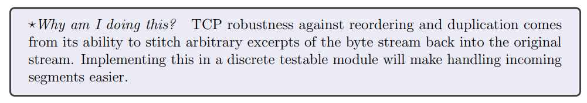
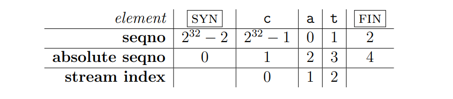
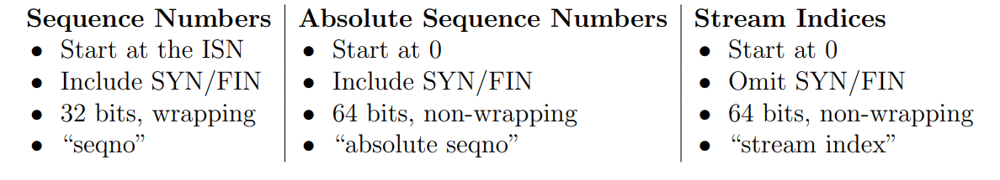
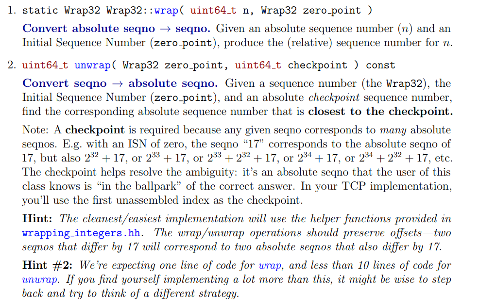
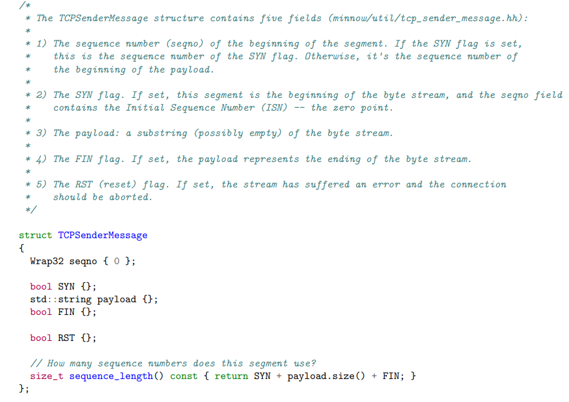
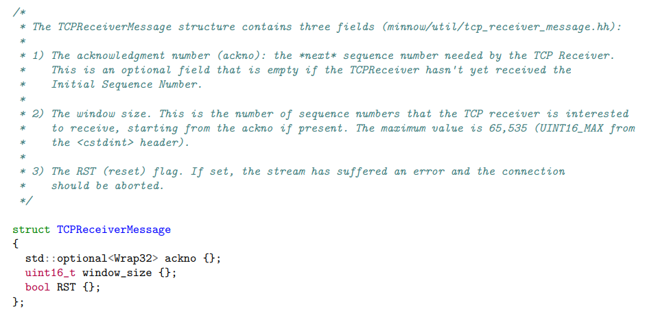

# CS144

## lab0

[lab0文档](https://tryanel.github.io/Documents/check0.pdf)

### Networking by hand

主要是一些命令行操作

#### Fetch a Web page

1. 在浏览器中打开`http://cs144.keithw.org/hello`将会看到`Hello, CS144!`

2. 在命令行输入`telnet cs144.keithw.org http`将会看到

   

   此时服务器正在等待我们的请求，可以输入这段代码，具体含义了解HTTP协议就知道，输入完了记得按两下回车（HTTP的包格式，还记得刚开始我只按了一次回车，结果就是超时没有反应，其实是格式不完整，服务器也不会做出响应，所以就超时了，因此一定要有两个回车换行）。

   ```bash
   $telnet cs144.keithw.org http
   Trying 104.196.238.229...
   Connected to cs144.keithw.org.
   Escape character is '^]'.
   GET /hello HTTP/1.1
   Host: cs144.keithw.org
   Connection: close
   
   HTTP/1.1 200 OK
   Date: Tue, 04 Jun 2024 12:31:28 GMT
   Server: Apache
   Last-Modified: Thu, 13 Dec 2018 15:45:29 GMT
   ETag: "e-57ce93446cb64"
   Accept-Ranges: bytes
   Content-Length: 14
   Connection: close
   Content-Type: text/plain
   
   Hello, CS144!
   Connection closed by foreign host.
   ```

3. 根据要求发送 SUNet ID 来获取 secret code。因为并没有真实的 ID，所以这里用随机的数字替代。

   ```bash
   $telnet cs144.keithw.org http
   Trying 104.196.238.229...
   Connected to cs144.keithw.org.
   Escape character is '^]'.
   GET /lab0/1234 HTTP/1.1
   Host: cs144.keithw.org
   Connetction: close
   
   HTTP/1.1 200 OK
   Date: Tue, 04 Jun 2024 12:37:10 GMT
   Server: Apache
   X-You-Said-Your-SunetID-Was: 1234
   X-Your-Code-Is: 997233
   Content-length: 108
   Vary: Accept-Encoding
   Content-Type: text/plain
   
   Hello! You told us that your SUNet ID was "1234". Please see the HTTP headers (above) for your secret code.
   ```

#### Send yourself an email

这里需要真实的SUNet ID，所以不做了。

#### Listening and connecting

```bash
# terminal 1
$netcat -v -l -p 9090
Listening on 0.0.0.0 9090
Connection received on localhost 49336
hello
你好

# terminal 2
$telnet localhost 9090
Trying 127.0.0.1...
Connected to localhost.
Escape character is '^]'.
hello
你好
```

### Writing a network program using an OS stream socket

先把minnow仓库克隆到本地：`git clone https://github.com/cs144/minnow`

#### Writing webget

文档重要信息：

It’s time to implement **webget**, a program to fetch Web pages over the Internet using the operating system’s TCP support and stream-socket abstraction——just like you did by hand earlier in this lab.

1. From the build directory, open the file `../apps/webget.cc` in a text editor or IDE.
2. In the `get_URL` function, find the comment starting `// Your code here.`
3. Implement the simple Web client as described in this file, using the format of an HTTP (Web) request that you used earlier. Use the `TCPSocket` and `Address` classes.
4. Hints:

- Please note that in HTTP, each line must be ended with `\r\n` (it’s not sufficient to use just `\n` or `endl`).
- Don’t forget to include the `Connection: close` line in your client’s request. This tells the server that it shouldn’t wait around for your client to send any more requests after this one. Instead, the server will send one reply and then will immediately end its outgoing bytestream (the one from the server’s socket to your socket). You’ll discover that your incoming byte stream has ended because your socket will reach “EOF” (end of file) when you have read the entire byte stream coming from the server. That’s how your client will know that the server has finished its reply.
- Make sure to read and print all the output from the server until the socket reaches “EOF” (end of file)—**a single call to read is not enough**.
- We expect you’ll need to write about ten lines of code.

读完了之后就可以去实现`webget.cc`文件的`get_URL`函数：

```C++
void get_URL( const string& host, const string& path )
{
  // cerr << "Function called: get_URL(" << host << ", " << path << ")\n";
  // cerr << "Warning: get_URL() has not been implemented yet.\n";
  auto sc = TCPSocket();	// 创建套接字
  auto addr = Address(host, "http");	// 连接服务器的地址

  sc.connect(addr);	// 连接服务器

  // 发送HTTP请求
  sc.write("GET ");
  sc.write(path);
  sc.write(" HTTP/1.1\r\n");
  sc.write("Host: ");
  sc.write(host);
  sc.write("\r\n");
  sc.write("Connection: close\r\n\r\n");

  // 半关闭
  sc.shutdown(SHUT_WR);
  while (!sc.eof()) {
    string buf;
    sc.read(buf);
    cout << buf;
  }

  sc.close();
}
```

实现完成使用`cmake --build build`编译生成可执行文件在build目录下，进入build目录执行`./apps/webget cs144.keithw.org /hello`命令后可以看到服务器返回的信息：

```bash
HTTP/1.1 200 OK
Date: Fri, 06 Sep 2024 09:02:09 GMT
Server: Apache
Last-Modified: Thu, 13 Dec 2018 15:45:29 GMT
ETag: "e-57ce93446cb64"
Accept-Ranges: bytes
Content-Length: 14
Connection: close
Content-Type: text/plain

Hello, CS144!
```

可以看到结果与之前的一致

完成这些后执行`make check_webget`进行测试：

```bash
Cat@Cat:~/exing/CS144/minnow/build$make check_webget
Test project /home/cat/exing/CS144/minnow/build
    Start 1: compile with bug-checkers
1/2 Test #1: compile with bug-checkers ........   Passed    3.15 sec
    Start 2: t_webget
2/2 Test #2: t_webget .........................   Passed    1.52 sec

100% tests passed, 0 tests failed out of 2

Total Test time (real) =   4.67 sec
Built target check_webget
```

至此可以进入下一阶段

#### An in-memory reliable byte stream

> By now, you’ve seen how the abstraction of a reliable byte stream can be useful in communicating across the Internet, even though the Internet itself only provides the service of "best-effort" (unreliable) datagrams. 
>
> To finish off this week’s lab, you will implement, in memory on a single computer, an object that provides this abstraction. (You may have done something similar in CS 110.) Bytes are written on the “input” side and can be read, in the same sequence, from the “output” side. The byte stream is finite: the writer can end the input, and then no more bytes can be written. When the reader has read to the end of the stream, it will reach “EOF” (end of file) and no more bytes can be read. 
>
> Your byte stream will also be flow-controlled to limit its memory consumption at any given time. The object is initialized with a particular “capacity”: the maximum number of bytes it’s willing to store in its own memory at any given point. The byte stream will limit the writer in how much it can write at any given moment, to make sure that the stream doesn’t exceed its storage capacity. As the reader reads bytes and drains them from the stream, the writer is allowed to write more. Your byte stream is for use in a single thread—you don’t have to worry about concurrent writers/readers, locking, or race conditions. 
>
> To be clear: the byte stream is finite, but it can be almost arbitrarily long before the writer ends the input and finishes the stream. Your implementation must be able to handle streams that are much longer than the capacity. The capacity limits the number of bytes that are held in memory (written but not yet read) at a given point, but does not limit the length of the stream. An object with a capacity of only one byte could still carry a stream that is terabytes and terabytes long, as long as the writer keeps writing one byte at a time and the reader reads each byte before the writer is allowed to write the next byte. 

注意上面提到一个概念“EOF”，意思是字节流中writer端首先关闭了，其次reader端将所有的字节全部读取完了，此时字节流达到了EOF。

现在要求我们实现以下函数：

```C++
// Here’s what the interface looks like for the writer:
void push( std::string data ); // Push data to stream, but only as much as available capacity allows.
void close(); // Signal that the stream has reached its ending. Nothing more will be written.

bool is_closed() const; // Has the stream been closed?

uint64_t available_capacity() const; // How many bytes can be pushed to the stream right now?
uint64_t bytes_pushed() const; // Total number of bytes cumulatively pushed to the stream

// And here is the interface for the reader:
std::string_view peek() const; // Peek at the next bytes in the buffer
void pop( uint64_t len ); // Remove `len` bytes from the buffer

bool is_finished() const; // Is the stream finished (closed and fully popped)?
bool has_error() const; // Has the stream had an error?

uint64_t bytes_buffered() const; // Number of bytes currently buffered (pushed and not popped)
uint64_t bytes_popped() const; // Total number of bytes cumulatively popped from stream
/*
	可以根据这几个需求构思如何实现，特别是如何实现字节流，这里决定使用非常巧妙的环状字节流实现
	空间的循环利用，其实就是利用模运算，现在很多缓存大小也是这样计算。其余只需要根据注释提示在设置一个buf
	一个total number统计写的总数，一个total number统计读的总数，还有一个bool变量标记buffer是否关闭
*/
```

根据注释的描述以及文档的讲述补充`byte_stream.hh`文件：

```C++
#pragma once

#include <cstdint>
#include <string>
#include <string_view>
#include <vector>

class Reader;
class Writer;

class ByteStream
{
public:
  explicit ByteStream( uint64_t capacity );

  // Helper functions (provided) to access the ByteStream's Reader and Writer interfaces
  Reader& reader();
  const Reader& reader() const;
  Writer& writer();
  const Writer& writer() const;

  void set_error() { error_ = true; };       // Signal that the stream suffered an error.
  bool has_error() const { return error_; }; // Has the stream had an error?

protected:
  // Please add any additional state to the ByteStream here, and not to the Writer and Reader interfaces.
  uint64_t capacity_;
  bool error_ {};
  // 下面四行为补充
  std::vector<char> buf_;
  uint64_t nread_;
  uint64_t nwrite_;
  bool is_closed_;
};

class Writer : public ByteStream
{
public:
  void push( std::string data ); // Push data to stream, but only as much as available capacity allows.
  void close();                  // Signal that the stream has reached its ending. Nothing more will be written.

  bool is_closed() const;              // Has the stream been closed?
  uint64_t available_capacity() const; // How many bytes can be pushed to the stream right now?
  uint64_t bytes_pushed() const;       // Total number of bytes cumulatively pushed to the stream
};

class Reader : public ByteStream
{
public:
  std::string_view peek() const; // Peek at the next bytes in the buffer
  void pop( uint64_t len );      // Remove `len` bytes from the buffer

  bool is_finished() const;        // Is the stream finished (closed and fully popped)?
  uint64_t bytes_buffered() const; // Number of bytes currently buffered (pushed and not popped)
  uint64_t bytes_popped() const;   // Total number of bytes cumulatively popped from stream
};

/*
 * read: A (provided) helper function thats peeks and pops up to `len` bytes
 * from a ByteStream Reader into a string;
 */
void read( Reader& reader, uint64_t len, std::string& out );
```


补充后实现`byte_stream.cc`文件：

```C++
#include "byte_stream.hh"

using namespace std;

ByteStream::ByteStream( uint64_t capacity ) : capacity_( capacity ),buf_(vector<char>(capacity_)) ,nread_(0), nwrite_(0), is_closed_(false){}

bool Writer::is_closed() const
{
  // Your code here.
  return is_closed_;
  // return false;
}

void Writer::push( string data )
{
  for (const auto &item : data) {
    if (nwrite_ >= nread_ + capacity_) {
      return;
    }
    buf_[nwrite_ % capacity_] = item;	// 很优雅的字节流，实现了可循环利用空间
    ++nwrite_;
  }
}

void Writer::close()
{
  // Your code here.
  is_closed_ = true;
}

uint64_t Writer::available_capacity() const
{
  // Your code here.
  return capacity_ - (nwrite_ - nread_);
  // return {};
}

uint64_t Writer::bytes_pushed() const
{
  // Your code here.
  return nwrite_;
  // return {};
}

bool Reader::is_finished() const
{
  // Your code here.
  // return nread_ == capacity_;
  // return {};
  return is_closed_ && nread_ == nwrite_;
}

uint64_t Reader::bytes_popped() const
{
  // Your code here.
  return nread_;
  // return nread_;
  // return {};
}

string_view Reader::peek() const
{
  // Your code here.
  if (nread_ == nwrite_) return {};
  string_view sv(&buf_[nread_ % capacity_], 1);
  return sv;
  // return {};
}

void Reader::pop( uint64_t len )
{
  // (void)len;
  // Your code here.
  for (uint64_t i = 0; i < len; ++i) {
    if (nread_ < nwrite_) {
      ++nread_;
    }
    else {
      return;
    }
  }
}

uint64_t Reader::bytes_buffered() const
{
  // Your code here.
  return nwrite_ - nread_;
  // return {};
}
```

在build目录下make：

```bash
[ 42%] Built target util_debug
[ 57%] Built target minnow_debug
[ 68%] Built target minnow_testing_debug
[ 78%] Built target stream_copy
[ 89%] Built target webget
[100%] Built target tcp_native
```

然后make check0

```bash
make check0
Test project /home/cat/proj/cs144/lab0/minnow/build
      Start  1: compile with bug-checkers
 1/10 Test  #1: compile with bug-checkers ........   Passed    0.08 sec
      Start  2: t_webget
 2/10 Test  #2: t_webget .........................   Passed    1.19 sec
      Start  3: byte_stream_basics
 3/10 Test  #3: byte_stream_basics ...............   Passed    0.02 sec
      Start  4: byte_stream_capacity
 4/10 Test  #4: byte_stream_capacity .............   Passed    0.01 sec
      Start  5: byte_stream_one_write
 5/10 Test  #5: byte_stream_one_write ............   Passed    0.02 sec
      Start  6: byte_stream_two_writes
 6/10 Test  #6: byte_stream_two_writes ...........   Passed    0.01 sec
      Start  7: byte_stream_many_writes
 7/10 Test  #7: byte_stream_many_writes ..........   Passed    0.04 sec
      Start  8: byte_stream_stress_test
 8/10 Test  #8: byte_stream_stress_test ..........   Passed    0.24 sec
      Start 37: compile with optimization
 9/10 Test #37: compile with optimization ........   Passed    0.04 sec
      Start 38: byte_stream_speed_test
             ByteStream throughput: 0.61 Gbit/s
10/10 Test #38: byte_stream_speed_test ...........   Passed    0.19 sec

100% tests passed, 0 tests failed out of 10

Total Test time (real) =   1.86 sec
```

根据文档描述

> If all tests pass, the check0 test will then run a speed benchmark of your implementation. ==Anything faster than 0.1 Gbit/s== (in other words, 100 million bits per second) is acceptable for purposes of this class. (It is possible for an implementation to perform faster than 10 Gbit/s, but this depends on the speed of your computer and is not required.)

到此lab0所有任务完成，最后记得git管理一下项目代码

## lab1

[lab1文档](https://tryanel.github.io/Documents/check1.pdf)

### Getting started

首先合并lab1和lab0的代码：在与“minnow”同级目录下执行`git merge origin/check1-startercode`然后初始化一下build系统`cmake -S . -B build`，最后再build一下：`cmake --build build`

### Putting substrings in sequence

> As part of the lab assignment, you will implement a TCP receiver: the module that receives datagrams and turns them into a reliable byte stream to be read from the socket by the application—just as your webget program read the byte stream from the webserver in Checkpoint 0. 
>
> The TCP sender is dividing its byte stream up into short segments (substrings no more than about 1,460 bytes apiece) so that they each fit inside a datagram. But the network might reorder these datagrams, or drop them, or deliver them more than once. The receiver must reassemble the segments into the contiguous stream of bytes that they started out as. 
>
> In this lab you’ll write the data structure that will be responsible for this reassembly: a Reassembler. It will receive substrings, consisting of a string of bytes, and the index of the first byte of that string within the larger stream. Each byte of the stream has its own unique index, starting from zero and counting upwards. As soon as the Reassembler knows the next byte of the stream, it will write it to the Writer side of a ByteStream— the same ByteStream you implemented in checkpoint 0. The Reassembler’s “customer” can read from the Reader side of the same ByteStream.

重要信息：

- 网络可能会造成数据报重新排序、丢弃或多次传送
- 接收方必须将Segment重新组合，使其连续
- 每个子字符串都有第一个字节的索引
- 流的每个字节都有唯一索引，并且从0开始
- 流的下一字节被重组器接受应当立马将其写入流的Writer端

ps：我为什么要做这个？



先放上整个项目实现的东西：


总结文档内容大概就是告诉我们在lab0实现了字节流（ByteStream部分），现在lab1要实现StreamReassembler，这部分是TCP可靠传输的保证，使用滑动窗口思想实现。参考下图：


其中蓝色部分为已经缓存并且读走的字节，绿色部分为字节流中缓存的未被读走字节，红色部分为缓存在Reassembler内存中的字节（一般是substring的index不对，先缓存在这里面，等顺序正确后再将其放入ByteStream中）。比较复杂的应该是如何缓存，并且让其重新有序。

#### What should the Reassembler store internally?

1. Bytes that are the next bytes in the stream. The Reassembler should push these to the stream (output .writer()) as soon as they are known. 
2. Bytes that fit within the stream’s available capacity but can’t yet be written, because earlier bytes remain unknown. These should be stored internally in the Reassembler. 
3. Bytes that lie beyond the stream’s available capacity. These should be discarded. The Reassembler’s will not store any bytes that can’t be pushed to the ByteStream either immediately, or as soon as earlier bytes become known.

需求分析：

- 一个变量保存重组器的期待序列；
- 接收到了缺失部分字节的字节分组，并且字节分组的大小不超过ByteStream的容量则将其存在重组器的缓存中；
- 接收到了first_index不在接收范围内的字节分组直接丢弃，因为ByteStream处理不了该字节分组；
- 当重组器得到了缺失的字节分组时要立刻将缓冲区中所有能被推入的字节推入ByteStream中。（超出容量就截断）；
- 考虑特殊情况：first_index在接收范围内，但是字节本身长度大于容量的分组，则截断后缓存或推入ByteStream。

程序实现：

1. 一个uint64_t类型的变量记录期待的序列号，每次缓存或推入只需加上本次实际缓存或推入字节的长度维护好这个变量即可；

2. 超出ByteStream容量的分组可以利用上述变量进行分类，尽快找出应当抛弃的分组，并把缺失数据、符合条件的数据推入缓冲区；

3. 有序且唯一的存储数据分组：

   这部分比较复杂，复习的时候一定要详细阅读代码并结合画图。

   首先考虑数据结构，因为要频繁地插入删除，所以数组首先排除，其操作成本太高。考虑到我们需要有序地存储数据分组，可以使用以下数据结构：map、set、list，不过我们需要在区间[first_index, first_index + data.size]上不断地比较大小以找到插入的位置，由于map和set的查找算法（lower_bound和upper_bound）都不支持自定义谓词，所以只能使用时间复杂度O(n)支持谓词的算法，考虑到其空间开销却换来O(n)的时间复杂度，决定舍弃，使用简单的list即可。

   具体操作请看代码，这里不细说。

   

```C++
#pragma once

#include "byte_stream.hh"

#include <list>
#include <string>
#include <tuple>

class Reassembler
{
public:
  // Construct Reassembler to write into given ByteStream.
  explicit Reassembler( ByteStream&& output ) : output_( std::move( output ) ) {}

  /*
   * Insert a new substring to be reassembled into a ByteStream.
   *   `first_index`: the index of the first byte of the substring
   *   `data`: the substring itself
   *   `is_last_substring`: this substring represents the end of the stream
   *   `output`: a mutable reference to the Writer
   *
   * The Reassembler's job is to reassemble the indexed substrings (possibly out-of-order
   * and possibly overlapping) back into the original ByteStream. As soon as the Reassembler
   * learns the next byte in the stream, it should write it to the output.
   *
   * If the Reassembler learns about bytes that fit within the stream's available capacity
   * but can't yet be written (because earlier bytes remain unknown), it should store them
   * internally until the gaps are filled in.
   *
   * The Reassembler should discard any bytes that lie beyond the stream's available capacity
   * (i.e., bytes that couldn't be written even if earlier gaps get filled in).
   *
   * The Reassembler should close the stream after writing the last byte.
   */
  void insert( uint64_t first_index, std::string data, bool is_last_substring );

  // How many bytes are stored in the Reassembler itself?
  uint64_t bytes_pending() const;

  // Access output stream reader
  Reader& reader() { return output_.reader(); }
  const Reader& reader() const { return output_.reader(); }

  // Access output stream writer, but const-only (can't write from outside)
  const Writer& writer() const { return output_.writer(); }

private:
  void push_bytes( uint64_t first_index, std::string data, bool is_last_substring );
  void cache_bytes( uint64_t first_index, std::string data, bool is_last_substring );
  void flush_buffer();

  ByteStream output_; // the Reassembler writes to this ByteStream
  uint64_t nbytes_pending_ {};  // 在重组器缓存中的字节数
  uint64_t expecting_index_ {}; // 重组器期待的序列
  std::list<std::tuple<uint64_t, std::string, bool>> unordered_bytes_ {};
};

```


```C++
#include "reassembler.hh"

#include <algorithm>

using namespace std;

/*
  控制数据插入的方法：
  1. 筛选不符合条件的数据分组：
    - 字节流已经关闭却还要写的分组；
    - 已经没有空闲空间还要写的分组；
    - first_index不在接受范围内的分组。
  2. 处理数据，对于数据长度超过了缓冲区容量的分组，将其后半部分截断再存储；
  3. 根据first_index分类：
    - first_index > expecting_index_时，说明还有缺失数据，将该分组缓存；
    - 否则，将其压入字节流中；
  4. 最后更新缓冲区。
*/
void Reassembler::insert( uint64_t first_index, string data, bool is_last_substring )
{
  Writer &bytes_writer = output_.writer();
  // 筛选条件
  if ( const uint64_t unacceptable_idx = expecting_index_ + bytes_writer.available_capacity();
       bytes_writer.is_closed() || bytes_writer.available_capacity() == 0 || first_index >= unacceptable_idx )
    return;
  else if ( first_index + data.size() >= unacceptable_idx ) {
    is_last_substring = false;
    data.resize( unacceptable_idx - first_index );
  }
  if ( first_index > expecting_index_ ) {
    cache_bytes( first_index, move( data ), is_last_substring );
  } else {
    push_bytes( first_index, move( data ), is_last_substring );
  }
  flush_buffer();
}

uint64_t Reassembler::bytes_pending() const
{
  return nbytes_pending_;
}

/*
  将数据推入字节流的逻辑实现函数：
  1. first_index < expecting_index_的分组，说明其从expecting_index_开始往后的所有字节
  都是符合要求的，并且没有缺失，所以将其前面从0开始截去expecting_index_ - first_index
  个字节；
  2. 直接将data推入字节流中，维护好相关变量；
  3. 对于is_last_substring为true的分组，在将其推入字节流后应关闭字节流并清空缓冲区。
*/
void Reassembler::push_bytes( uint64_t first_index, string data, bool is_last_substring ) {
  if ( first_index < expecting_index_ ) 
    data.erase( 0, expecting_index_ - first_index );
  expecting_index_ += data.size();
  output_.writer().push( move(data) );

  if ( is_last_substring ) {
    output_.writer().close();
    unordered_bytes_.clear();
    nbytes_pending_ = 0;
  }
}

/*
  缓存逻辑实现函数：
  1. 先获取左右区间位置；
  2. 处理左区间重叠情况：
    - 新的分组数据包含在了原序列中，直接返回；
    - 没有重叠，对新数据不作任何操作，最后插入到合适为止即可；
    - 有重叠，根据具体重叠情况处理；
  3. 处理右区间重叠情况，对于处理完左侧的数据，当右侧有重叠时，将其与右侧
  原数据拼接
  4. 从left开始遍历，删除区间内所有的节点，插入新的数据
*/
void Reassembler::cache_bytes( uint64_t first_index, string data, bool is_last_substring ) {
  auto end = unordered_bytes_.end();
  // 获取左右区间
  auto left = lower_bound( unordered_bytes_.begin(), end, first_index, []( auto&& e, uint64_t idx ) -> bool {
    return idx > ( get<0>( e ) + get<1>( e ).size() );
  } );
  auto right = upper_bound( left, end, first_index + data.size(), []( uint64_t idx, auto&& e ) -> bool {
    return idx < get<0>( e );
  } );
  // 处理左区间有重叠
  if ( const uint64_t next_index = first_index + data.size(); left != end ) {
    auto& [lpoint, str, _] = *left;
    if ( const uint64_t rpoint = lpoint + str.size(); first_index >= lpoint && next_index <= rpoint  )
      return;
    else if ( next_index < lpoint )
      right = left;
    else if ( !( first_index <= lpoint && next_index >= rpoint ) ) {
      if ( first_index < lpoint ) {
        data.resize( data.size() - ( next_index - lpoint ) );
        data.append( str );
      } else {
        data.insert( 0, string_view( str.c_str(), str.size() - ( rpoint - first_index ) ) );
      }
      first_index = min( first_index, lpoint );
    }
  }
  // 处理右区间有重叠
  if ( const uint64_t next_index = first_index + data.size(); right != left && !unordered_bytes_.empty() ) {
    auto& [lpoint, str, _] = *prev( right );
    if ( const uint64_t rpoint = lpoint + str.size(); rpoint > next_index ) {
      data.resize( data.size() - ( next_index - lpoint ) );
      data.append( str );
    }
  }
  // 删除区间内的节点
  for ( ;left != right; left = unordered_bytes_.erase( left ) ) {
    nbytes_pending_ -= get<1>( *left ).size();
    is_last_substring |= get<2>( *left );
  }
  nbytes_pending_ += data.size();
  unordered_bytes_.insert( left, { first_index, move( data ), is_last_substring } );
}

/*
  刷新缓冲区逻辑实现函数：
  一直将可以push的字节push掉即可
*/
void Reassembler::flush_buffer() {
  while ( !unordered_bytes_.empty() ) {
    auto& [index, str, is_last] = unordered_bytes_.front();
    if ( index > expecting_index_ )
      break;
    nbytes_pending_ -= str.size();
    push_bytes( index, move( str ), is_last );
    if ( !unordered_bytes_.empty() )
      unordered_bytes_.pop_front();
  }
}
```

编写完后在`minnow`目录下执行`cmake --build build --target check1`即可开始测试，下面附上成功的结果：

```bash
Test project /home/sniffstherose/cs144/minnow/build
      Start  1: compile with bug-checkers
 1/17 Test  #1: compile with bug-checkers ........   Passed    1.84 sec
      Start  3: byte_stream_basics
 2/17 Test  #3: byte_stream_basics ...............   Passed    0.06 sec
      Start  4: byte_stream_capacity
 3/17 Test  #4: byte_stream_capacity .............   Passed    0.06 sec
      Start  5: byte_stream_one_write
 4/17 Test  #5: byte_stream_one_write ............   Passed    0.06 sec
      Start  6: byte_stream_two_writes
 5/17 Test  #6: byte_stream_two_writes ...........   Passed    0.06 sec
      Start  7: byte_stream_many_writes
 6/17 Test  #7: byte_stream_many_writes ..........   Passed    0.08 sec
      Start  8: byte_stream_stress_test
 7/17 Test  #8: byte_stream_stress_test ..........   Passed    0.13 sec
      Start  9: reassembler_single
 8/17 Test  #9: reassembler_single ...............   Passed    0.05 sec
      Start 10: reassembler_cap
 9/17 Test #10: reassembler_cap ..................   Passed    0.06 sec
      Start 11: reassembler_seq
10/17 Test #11: reassembler_seq ..................   Passed    0.06 sec
      Start 12: reassembler_dup
11/17 Test #12: reassembler_dup ..................   Passed    0.08 sec
      Start 13: reassembler_holes
12/17 Test #13: reassembler_holes ................   Passed    0.06 sec
      Start 14: reassembler_overlapping
13/17 Test #14: reassembler_overlapping ..........   Passed    0.07 sec
      Start 15: reassembler_win
14/17 Test #15: reassembler_win ..................   Passed    0.29 sec
      Start 37: compile with optimization
15/17 Test #37: compile with optimization ........   Passed    0.57 sec
      Start 38: byte_stream_speed_test
             ByteStream throughput: 28.21 Gbit/s
16/17 Test #38: byte_stream_speed_test ...........   Passed    0.07 sec
      Start 39: reassembler_speed_test
             Reassembler throughput: 11.44 Gbit/s
17/17 Test #39: reassembler_speed_test ...........   Passed    0.13 sec

100% tests passed, 0 tests failed out of 17

Total Test time (real) =   3.85 sec
```

> ::在做这个实验的时候出现了一个非常操蛋的失误，我把上面.cc文件中105行`data.resize( data.size() - ( next_index - lpoint ) );`的`data.size()`写成了`str.size()`（但脑子里想的就是data.size()）导致测试不通过，GDB各种排查，最终排查到了这个if语句内，但是看了半天也没看出逻辑哪里不对最后断点打到106行才注意到这个`str.size()`😅。

最后git提交一下即可进入下一阶段😎。

## lab 2

### Overview

概述部分告诉我们已经实现了控制字节流抽象和重组器，接下来需要实现TCPReceiver，并且告诉我们TCPReceiver会通过`send()`方法给发送方返回两个消息：（1）ACK，即确认号；（2）window size，即接收方缓冲区可用空间大小。最后告诉我们大部分算法工作已经在前两个实验完成了，现在最难的是TCP如何表示每个字节在流中的位置（序列号）。

### Getting started

老样子了，先merge当前lab的分支，然后set up一下build system。

### Checkpoint 2: The TCP Receiver

废话了一下TCP的特性，并讲了讲为什么要这么做，基本就是回答TCP为什么可靠。

#### Translating between 64-bit indexes and 32-bit seqnos

这里告诉我们虽然重组器内用的都是64bit（`uint64_t`）的索引表示序列，但是在实际TCP中由于空间的宝贵，都是使用32bit的序列号来表示，所以我们需要额外做一些工作：

1. 我们需要设计一下序列的表示。虽然TCP能发送的数据是无限的，但是32位的序列号最大也就4GB的数据，如果大于4GB的数据怎么办呢？那就需要当序列号累计到了2^32 - 1时从0开始重新往上增长。
2. TCP序列号应以一个随机值作为开始。为了健壮性以及避免和旧连接混淆，TCP序列号随机一个32位的数当做ISN（初始序列号），表示为SYN（流的开始），此后的序列号将递增，比如真正数据第一个字节为：ISN + 1 mod 2^32。
3. 一个字节流的逻辑开头和结尾应当标识出来，所以这俩也会占用序列号，就是熟知的SYN和FIN标志位，这两个不是流本身的一部分，只是需要辅助作用我们添加的开始和结束部分。

举了个例子，方便我们区分序列号、绝对序列号（可以理解为从0开始的逻辑上的序列）、stream index，假设有一个字符串"cat"，如果其ISN为2^32 - 2则其各个部分如下图：



三者的对比：



可以看出来在绝对序列号和stream index之间的转换很简单，只需加减1，但是想把序列号转换为stream index非常棘手，文档告诉我们为了系统得避免混淆这三者导致出现bug，这里使用自定义类型`Wrap32`来表示序列号，并且实现一个与绝对序列号转换的方法。

接下来就到`wrapping_integers.hh`和`wrapping_integers.cc`两个文件实现代码。

文档告诉我们：



需求分析：

1. 序列号到达2^32 - 1时下一个序列号应当从0开始，这一点会因为64bit转换为32bit自动进行；
2. 32位的序列号转换成64为的绝对序列号。

程序实现（实现的过程切不可多想，只需要解决序列转换问题即可，别的先不管）：

1. `wrap()`函数比较简单，根据上面的关系我们可以知道直接将给定的zero_point加上n即可得到；

2. `unwrap()`函数比较复杂：

   参数给定一个zero_point和checkpoint，那么什么是checkpoint呢？checkpoint其实就是目前已经push到了ByteStream中的字节的绝对序列，也就是nbytes_pushed_ + 1。我们要根据这个checkpoint求得距离checkpoint最近的绝对序列，具体的原因上述文档中有描述。我们要求的绝对序列实际上应当是当前消息的绝对序列，那为啥又要求这个呢？因为我们要调用lab1的重组器来重组并push，它需要的第一个参数就是first_index，也就是当前数据分组的stream index，在上面的表中可以看到它可以和绝对序列进行加减1的转换，所以需要求出当前消息的绝对序列。我们可以利用checkpoint的模值求得其和当前消息模值的距离，然后将这个距离加到原始checkpoint上，不过这里有一些细节，详见这篇文章：[CS144（2024 Winter）Lab Checkpoint 2: the TCP receiver_cs144 lab2-CSDN博客](https://blog.csdn.net/Kovnt/article/details/135793894)

```C++
// wrappint_integers.hh
#pragma once

#include <cstdint>

/*
 * The Wrap32 type represents a 32-bit unsigned integer that:
 *    - starts at an arbitrary "zero point" (initial value), and
 *    - wraps back to zero when it reaches 2^32 - 1.
 */

class Wrap32
{
public:
  explicit Wrap32( uint32_t raw_value ) : raw_value_( raw_value ) {}

  /* Construct a Wrap32 given an absolute sequence number n and the zero point. */
  static Wrap32 wrap( uint64_t n, Wrap32 zero_point );

  /*
   * The unwrap method returns an absolute sequence number that wraps to this Wrap32, given the zero point
   * and a "checkpoint": another absolute sequence number near the desired answer.
   *
   * There are many possible absolute sequence numbers that all wrap to the same Wrap32.
   * The unwrap method should return the one that is closest to the checkpoint.
   */
  uint64_t unwrap( Wrap32 zero_point, uint64_t checkpoint ) const;

  Wrap32 operator+( uint32_t n ) const { return Wrap32 { raw_value_ + n }; }
  bool operator==( const Wrap32& other ) const { return raw_value_ == other.raw_value_; }

protected:
  uint32_t raw_value_ {};
};
```


```C++
// wrappint_integers.cc
#include "wrapping_integers.hh"

using namespace std;

Wrap32 Wrap32::wrap( uint64_t n, Wrap32 zero_point )
{
  return zero_point + n;
}

uint64_t Wrap32::unwrap( Wrap32 zero_point, uint64_t checkpoint ) const
{
  // 32bit的上界
  uint64_t upper = static_cast<uint64_t>(UINT32_MAX) + 1;
  // checkpoint + zero_point
  const uint32_t checkpoint_mod = Wrap32::wrap( checkpoint, zero_point ).raw_value_;
  // 如果raw_value < checkpoint_mod，因为这是无符号减法，所以相当于checkpoint_mod - raw_value
  uint32_t distance = raw_value_ - checkpoint_mod;
  // 如果距离大于一般或者加起来超过界限了，说明要求的绝对序列小于checkpoint的，减去一个2^32
  if ( distance <= ( upper >> 1 ) || checkpoint + distance < upper )
    return checkpoint + distance;
  return checkpoint + distance - upper;
}
```

#### Implementing the TCP receiver

这部分让我们实现TCPReceiver，这个类做两个工作：

1. 接收对等的发送者发送的消息，并使用Reassembler重组ByteStream；
2. 包装返回给发送者的信息，包含确认号、窗口大小。

紧接着介绍了一下"sender message"，这个message是从sender到receiver的消息：



还有receiver的消息结构体，这个消息是receiver生成并返回给sender的：



注意文档的用词“peer's”，接收方和发送方是对等的。

这部分没有太大难点，主要就是coding问题了：

```C++
// tcp_receiver.hh
#pragma once

#include "reassembler.hh"
#include "tcp_receiver_message.hh"
#include "tcp_sender_message.hh"

class TCPReceiver
{
public:
  // Construct with given Reassembler
  explicit TCPReceiver( Reassembler&& reassembler ) : reassembler_( std::move( reassembler ) ) {}

  /*
   * The TCPReceiver receives TCPSenderMessages, inserting their payload into the Reassembler
   * at the correct stream index.
   */
  void receive( TCPSenderMessage message );

  // The TCPReceiver sends TCPReceiverMessages to the peer's TCPSender.
  TCPReceiverMessage send() const;

  // Access the output (only Reader is accessible non-const)
  const Reassembler& reassembler() const { return reassembler_; }
  Reader& reader() { return reassembler_.reader(); }
  const Reader& reader() const { return reassembler_.reader(); }
  const Writer& writer() const { return reassembler_.writer(); }

private:
  Reassembler reassembler_;
  std::optional<Wrap32> ISN_ {};  // 因为TCP SYN 序列是随机的，所以需要一个变量来维护
};

```

```C++
// tcp_receiver.cc
#include "tcp_receiver.hh"

using namespace std;

/*
  接收消息并调用重组器：
  这个函数要实现的功能主要有：
    - 计算stream index
    - 排除不正确的message
  实现思路：
    1. stream index可以根据absolute seqno来计算，所以我们需要先计算absolute seqno，
    这里可以用到wrapping_integers里实现好的Wrap32类来实现相关转换。首先找到一个check
    -point，然后只需要调用unwrap函数求得对应的absolute seqno即可，注意最后插入的时候
    我们要考虑SYN，所以应该插入absolute seqno - 1（0除外）；
    2. 要排除不正确的message，主要有两种情况：
      - 刚接收一个SYN报文，下一个又是序号为ISN的；
      - 还未接收SYN报文，但是来的消息不是SYN报文。

*/
void TCPReceiver::receive( TCPSenderMessage message )
{
  const uint64_t checkpoint = reassembler_.writer().bytes_pushed() + ISN_.has_value();
  if ( message.RST ) {
    reassembler_.reader().set_error();
  } else if ( checkpoint > 0 && checkpoint <= UINT32_MAX && message.seqno == ISN_ ) 
    return;
  if ( !ISN_.has_value() ) {
    if ( !message.SYN )
      return;
    ISN_ = message.seqno;
  }
  const uint64_t abso_seqno = message.seqno.unwrap( *ISN_, checkpoint );
  reassembler_.insert( abso_seqno == 0 ? abso_seqno : abso_seqno - 1, move( message.payload ), message.FIN );
}


/*
  返回给发送方相关信息
  这个函数主要实现一个内容：返回确认号、接收窗口大小、断开连接标志位。
  这个函数实现比较简单，具体看代码即可。
*/
TCPReceiverMessage TCPReceiver::send() const
{
  const uint64_t checkpoint = reassembler_.writer().bytes_pushed() + ISN_.has_value();
  const uint64_t capacity = reassembler_.writer().available_capacity();
  const uint16_t wnd_size = capacity > UINT16_MAX ? UINT16_MAX : capacity;
  if ( !ISN_.has_value() )
    return { {}, wnd_size, reassembler_.writer().has_error() };
  // 如果关闭了，则发送FIN包
  return  { Wrap32::wrap( checkpoint + reassembler_.writer().is_closed(),  *ISN_),
            wnd_size,
            reassembler_.writer().has_error() };
}

```

两部分都完成后在minnow目录下执行`cmake --build build --target check2`，下面附上通过结果：

```bash
Test project /home/sniffstherose/cs144/minnow/build
      Start  1: compile with bug-checkers
 1/29 Test  #1: compile with bug-checkers ........   Passed   16.22 sec
      Start  3: byte_stream_basics
 2/29 Test  #3: byte_stream_basics ...............   Passed    0.06 sec
      Start  4: byte_stream_capacity
 3/29 Test  #4: byte_stream_capacity .............   Passed    0.05 sec
      Start  5: byte_stream_one_write
 4/29 Test  #5: byte_stream_one_write ............   Passed    0.05 sec
      Start  6: byte_stream_two_writes
 5/29 Test  #6: byte_stream_two_writes ...........   Passed    0.06 sec
      Start  7: byte_stream_many_writes
 6/29 Test  #7: byte_stream_many_writes ..........   Passed    0.08 sec
      Start  8: byte_stream_stress_test
 7/29 Test  #8: byte_stream_stress_test ..........   Passed    0.15 sec
      Start  9: reassembler_single
 8/29 Test  #9: reassembler_single ...............   Passed    0.06 sec
      Start 10: reassembler_cap
 9/29 Test #10: reassembler_cap ..................   Passed    0.06 sec
      Start 11: reassembler_seq
10/29 Test #11: reassembler_seq ..................   Passed    0.06 sec
      Start 12: reassembler_dup
11/29 Test #12: reassembler_dup ..................   Passed    0.08 sec
      Start 13: reassembler_holes
12/29 Test #13: reassembler_holes ................   Passed    0.06 sec
      Start 14: reassembler_overlapping
13/29 Test #14: reassembler_overlapping ..........   Passed    0.06 sec
      Start 15: reassembler_win
14/29 Test #15: reassembler_win ..................   Passed    0.28 sec
      Start 16: wrapping_integers_cmp
15/29 Test #16: wrapping_integers_cmp ............   Passed    0.02 sec
      Start 17: wrapping_integers_wrap
16/29 Test #17: wrapping_integers_wrap ...........   Passed    0.02 sec
      Start 18: wrapping_integers_unwrap
17/29 Test #18: wrapping_integers_unwrap .........   Passed    0.01 sec
      Start 19: wrapping_integers_roundtrip
18/29 Test #19: wrapping_integers_roundtrip ......   Passed    1.40 sec
      Start 20: wrapping_integers_extra
19/29 Test #20: wrapping_integers_extra ..........   Passed    0.31 sec
      Start 21: recv_connect
20/29 Test #21: recv_connect .....................   Passed    0.06 sec
      Start 22: recv_transmit
21/29 Test #22: recv_transmit ....................   Passed    0.31 sec
      Start 23: recv_window
22/29 Test #23: recv_window ......................   Passed    0.07 sec
      Start 24: recv_reorder
23/29 Test #24: recv_reorder .....................   Passed    0.08 sec
      Start 25: recv_reorder_more
24/29 Test #25: recv_reorder_more ................   Passed    0.78 sec
      Start 26: recv_close
25/29 Test #26: recv_close .......................   Passed    0.09 sec
      Start 27: recv_special
26/29 Test #27: recv_special .....................   Passed    0.09 sec
      Start 37: compile with optimization
27/29 Test #37: compile with optimization ........   Passed    1.76 sec
      Start 38: byte_stream_speed_test
             ByteStream throughput: 28.69 Gbit/s
28/29 Test #38: byte_stream_speed_test ...........   Passed    0.07 sec
      Start 39: reassembler_speed_test
             Reassembler throughput: 12.50 Gbit/s
29/29 Test #39: reassembler_speed_test ...........   Passed    0.13 sec

100% tests passed, 0 tests failed out of 29

Total Test time (real) =  22.72 sec
```

> ::这部分折磨死我了，特别是wrap和unwrap，总感觉脑袋转不过来，模运算一生之敌啊。

最后记得git提交一下即可进入下一阶段😢

## lab3

### Overview

老样子，告诉我们前面的实验做了啥。还有这次实验要实现TCPSender，作为TCP连接的另一端。还告诉我们lab4将把所有的实现结合起来。

### Getting started

老样子，merge一下初始代码，初始化build system。
