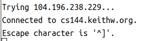
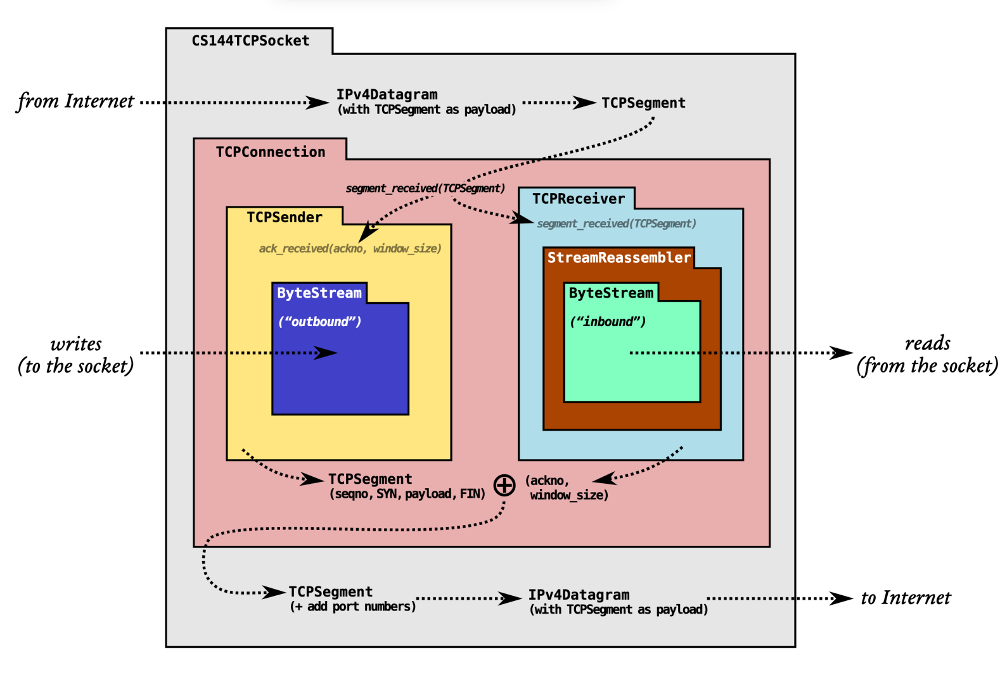
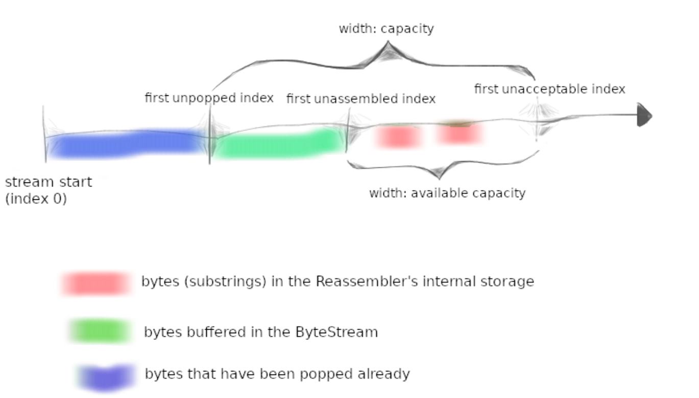
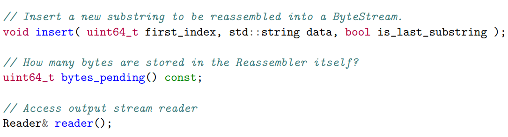

# CS144

# lab0

## Networking by hand

主要是一些命令行操作

### Fetch a Web page

1. 在浏览器中打开`http://cs144.keithw.org/hello`将会看到`Hello, CS144!`

2. 在命令行输入`telnet cs144.keithw.org http`将会看到

   

   此时服务器正在等待我们的请求，可以输入这段代码，具体含义了解HTTP协议就知道，输入完了记得按两下回车（HTTP的包格式，还记得刚开始我只按了一次回车，结果就是超时没有反应，其实是格式不完整，服务器也不会做出响应，所以就超时了，因此一定要有两个回车换行）。

   ```bash
   $telnet cs144.keithw.org http
   Trying 104.196.238.229...
   Connected to cs144.keithw.org.
   Escape character is '^]'.
   GET /hello HTTP/1.1
   Host: cs144.keithw.org
   Connection: close
   
   HTTP/1.1 200 OK
   Date: Tue, 04 Jun 2024 12:31:28 GMT
   Server: Apache
   Last-Modified: Thu, 13 Dec 2018 15:45:29 GMT
   ETag: "e-57ce93446cb64"
   Accept-Ranges: bytes
   Content-Length: 14
   Connection: close
   Content-Type: text/plain
   
   Hello, CS144!
   Connection closed by foreign host.
   ```

3. 根据要求发送 SUNet ID 来获取 secret code。因为并没有真实的 ID，所以这里用随机的数字替代。

   ```bash
   $telnet cs144.keithw.org http
   Trying 104.196.238.229...
   Connected to cs144.keithw.org.
   Escape character is '^]'.
   GET /lab0/1234 HTTP/1.1
   Host: cs144.keithw.org
   Connetction: close
   
   HTTP/1.1 200 OK
   Date: Tue, 04 Jun 2024 12:37:10 GMT
   Server: Apache
   X-You-Said-Your-SunetID-Was: 1234
   X-Your-Code-Is: 997233
   Content-length: 108
   Vary: Accept-Encoding
   Content-Type: text/plain
   
   Hello! You told us that your SUNet ID was "1234". Please see the HTTP headers (above) for your secret code.
   ```

### Send yourself an email

这里需要真实的SUNet ID，所以不做了。

### Listening and connecting

```bash
# terminal 1
$netcat -v -l -p 9090
Listening on 0.0.0.0 9090
Connection received on localhost 49336
hello
你好

# terminal 2
$telnet localhost 9090
Trying 127.0.0.1...
Connected to localhost.
Escape character is '^]'.
hello
你好
```

## Writing a network program using an OS stream socket

先把minnow仓库克隆到本地：`git clone https://github.com/cs144/minnow`

### Writing webget

文档重要信息：

It’s time to implement **webget**, a program to fetch Web pages over the Internet using the operating system’s TCP support and stream-socket abstraction——just like you did by hand earlier in this lab.

1. From the build directory, open the file `../apps/webget.cc` in a text editor or IDE.
2. In the `get_URL` function, find the comment starting `// Your code here.`
3. Implement the simple Web client as described in this file, using the format of an HTTP (Web) request that you used earlier. Use the `TCPSocket` and `Address` classes.
4. Hints:

- Please note that in HTTP, each line must be ended with `\r\n` (it’s not sufficient to use just `\n` or `endl`).
- Don’t forget to include the `Connection: close` line in your client’s request. This tells the server that it shouldn’t wait around for your client to send any more requests after this one. Instead, the server will send one reply and then will immediately end its outgoing bytestream (the one from the server’s socket to your socket). You’ll discover that your incoming byte stream has ended because your socket will reach “EOF” (end of file) when you have read the entire byte stream coming from the server. That’s how your client will know that the server has finished its reply.
- Make sure to read and print all the output from the server until the socket reaches “EOF” (end of file)—**a single call to read is not enough**.
- We expect you’ll need to write about ten lines of code.

读完了之后就可以去实现`webget.cc`文件的`get_URL`函数：

```C++
void get_URL( const string& host, const string& path )
{
  // cerr << "Function called: get_URL(" << host << ", " << path << ")\n";
  // cerr << "Warning: get_URL() has not been implemented yet.\n";
  auto sc = TCPSocket();	// 创建套接字
  auto addr = Address(host, "http");	// 连接服务器的地址

  sc.connect(addr);	// 连接服务器

  // 发送HTTP请求
  sc.write("GET ");
  sc.write(path);
  sc.write(" HTTP/1.1\r\n");
  sc.write("Host: ");
  sc.write(host);
  sc.write("\r\n");
  sc.write("Connection: close\r\n\r\n");

  // 半关闭
  sc.shutdown(SHUT_WR);
  while (!sc.eof()) {
    string buf;
    sc.read(buf);
    cout << buf;
  }

  sc.close();
}
```

实现完成使用`cmake --build build`编译生成可执行文件在build目录下，进入build目录执行`./apps/webget cs144.keithw.org /hello`命令后可以看到服务器返回的信息：

```bash
HTTP/1.1 200 OK
Date: Fri, 06 Sep 2024 09:02:09 GMT
Server: Apache
Last-Modified: Thu, 13 Dec 2018 15:45:29 GMT
ETag: "e-57ce93446cb64"
Accept-Ranges: bytes
Content-Length: 14
Connection: close
Content-Type: text/plain

Hello, CS144!
```

可以看到结果与之前的一致

完成这些后执行`make check_webget`进行测试：

```bash
Cat@Cat:~/exing/CS144/minnow/build$make check_webget
Test project /home/cat/exing/CS144/minnow/build
    Start 1: compile with bug-checkers
1/2 Test #1: compile with bug-checkers ........   Passed    3.15 sec
    Start 2: t_webget
2/2 Test #2: t_webget .........................   Passed    1.52 sec

100% tests passed, 0 tests failed out of 2

Total Test time (real) =   4.67 sec
Built target check_webget
```

至此可以进入下一阶段

## An in-memory reliable byte stream

> By now, you’ve seen how the abstraction of a reliable byte stream can be useful in communicating across the Internet, even though the Internet itself only provides the service of "best-effort" (unreliable) datagrams. 
>
> To finish off this week’s lab, you will implement, in memory on a single computer, an object that provides this abstraction. (You may have done something similar in CS 110.) Bytes are written on the “input” side and can be read, in the same sequence, from the “output” side. The byte stream is finite: the writer can end the input, and then no more bytes can be written. When the reader has read to the end of the stream, it will reach “EOF” (end of file) and no more bytes can be read. 
>
> Your byte stream will also be flow-controlled to limit its memory consumption at any given time. The object is initialized with a particular “capacity”: the maximum number of bytes it’s willing to store in its own memory at any given point. The byte stream will limit the writer in how much it can write at any given moment, to make sure that the stream doesn’t exceed its storage capacity. As the reader reads bytes and drains them from the stream, the writer is allowed to write more. Your byte stream is for use in a single thread—you don’t have to worry about concurrent writers/readers, locking, or race conditions. 
>
> To be clear: the byte stream is finite, but it can be almost arbitrarily long before the writer ends the input and finishes the stream. Your implementation must be able to handle streams that are much longer than the capacity. The capacity limits the number of bytes that are held in memory (written but not yet read) at a given point, but does not limit the length of the stream. An object with a capacity of only one byte could still carry a stream that is terabytes and terabytes long, as long as the writer keeps writing one byte at a time and the reader reads each byte before the writer is allowed to write the next byte. 

注意上面提到一个概念“EOF”，意思是字节流中writer端首先关闭了，其次reader端将所有的字节全部读取完了，此时字节流达到了EOF。

现在要求我们实现以下函数：

```C++
// Here’s what the interface looks like for the writer:
void push( std::string data ); // Push data to stream, but only as much as available capacity allows.
void close(); // Signal that the stream has reached its ending. Nothing more will be written.

bool is_closed() const; // Has the stream been closed?

uint64_t available_capacity() const; // How many bytes can be pushed to the stream right now?
uint64_t bytes_pushed() const; // Total number of bytes cumulatively pushed to the stream

// And here is the interface for the reader:
std::string_view peek() const; // Peek at the next bytes in the buffer
void pop( uint64_t len ); // Remove `len` bytes from the buffer

bool is_finished() const; // Is the stream finished (closed and fully popped)?
bool has_error() const; // Has the stream had an error?

uint64_t bytes_buffered() const; // Number of bytes currently buffered (pushed and not popped)
uint64_t bytes_popped() const; // Total number of bytes cumulatively popped from stream
/*
	可以根据这几个需求构思如何实现，特别是如何实现字节流，这里决定使用非常巧妙的环状字节流实现
	空间的循环利用，其实就是利用模运算，现在很多缓存大小也是这样计算。其余只需要根据注释提示在设置一个buf
	一个total number统计写的总数，一个total number统计读的总数，还有一个bool变量标记buffer是否关闭
*/
```

根据注释的描述以及文档的讲述补充`byte_stream.hh`文件：

```C++
#pragma once

#include <cstdint>
#include <string>
#include <string_view>
#include <queue>

class Reader;
class Writer;

class ByteStream
{
public:
  explicit ByteStream( uint64_t capacity );

  // Helper functions (provided) to access the ByteStream's Reader and Writer interfaces
  Reader& reader();
  const Reader& reader() const;
  Writer& writer();
  const Writer& writer() const;

  void set_error() { error_ = true; };       // Signal that the stream suffered an error.
  bool has_error() const { return error_; }; // Has the stream had an error?

protected:
  // Please add any additional state to the ByteStream here, and not to the Writer and Reader interfaces.
  uint64_t capacity_ {};
  uint64_t nbytes_pushed_ {};	// bytestream中压入的总字节数
  uint64_t nbytes_popped_ {};	// bytestream中弹出的总数
  uint64_t nbytes_buffered_ {};	// bytestream中现在的字节数
  bool is_closed_ {};
  bool error_ {};
  std::queue<std::string> buf_ {};	// 缓冲区
  std::string_view view_wnd_ {};
};

class Writer : public ByteStream
{
public:
  void push( std::string data ); // Push data to stream, but only as much as available capacity allows.
  void close();                  // Signal that the stream has reached its ending. Nothing more will be written.

  bool is_closed() const;              // Has the stream been closed?
  uint64_t available_capacity() const; // How many bytes can be pushed to the stream right now?
  uint64_t bytes_pushed() const;       // Total number of bytes cumulatively pushed to the stream
};

class Reader : public ByteStream
{
public:
  std::string_view peek() const; // Peek at the next bytes in the buffer
  void pop( uint64_t len );      // Remove `len` bytes from the buffer

  bool is_finished() const;        // Is the stream finished (closed and fully popped)?
  uint64_t bytes_buffered() const; // Number of bytes currently buffered (pushed and not popped)
  uint64_t bytes_popped() const;   // Total number of bytes cumulatively popped from stream
};

/*
 * read: A (provided) helper function thats peeks and pops up to `len` bytes
 * from a ByteStream Reader into a string;
 */
void read( Reader& reader, uint64_t len, std::string& out );
```


补充后实现`byte_stream.cc`文件：

```C++
#include "byte_stream.hh"

using namespace std;

ByteStream::ByteStream( uint64_t capacity ) : capacity_( capacity ){}

bool Writer::is_closed() const
{
  return is_closed_;
}

/*
  写函数：
  1. 首先判断bytestream是否关闭若已关闭则退出
  2. 若未关闭则处理data的长度，防止越界
  3. 维护各变量并将data写入缓冲区
  4. 如果此时窗口的大小为0则将新加入buf的数据给到窗口
*/
void Writer::push( string data )
{
  if ( is_closed() ) {
    return;
  }
  if ( data.size() > available_capacity() ) {
    data.resize( available_capacity() );
  }

  if ( !data.empty() ) {
    nbytes_pushed_ += data.size();
    nbytes_buffered_ += data.size();
    buf_.emplace( move(data) );
  }
  if ( view_wnd_.empty() && !buf_.empty() ) {
    view_wnd_ = buf_.front();
  }
}

void Writer::close()
{
  if ( !is_closed_ ) {
    is_closed_ = true;
  }
}

uint64_t Writer::available_capacity() const
{
  return capacity_ - nbytes_buffered_;
}

uint64_t Writer::bytes_pushed() const
{
  return nbytes_pushed_;
}

bool Reader::is_finished() const
{

  return is_closed_ && bytes_buffered() == 0;
}

uint64_t Reader::bytes_popped() const
{
  return nbytes_popped_;
}

string_view Reader::peek() const
{
  return view_wnd_;
}

/*
  删除字节：
  1. 由于底层采用了queue<string>当缓冲区容器，所以需要按照单个string的长度来弹出
  2. 小于的部分直接弹出窗口的内容即可
*/
void Reader::pop( uint64_t len )
{
  uint64_t temp = len;
  while ( temp >= view_wnd_.size() && temp != 0 ) {
    temp -= view_wnd_.size();
    buf_.pop();
    view_wnd_ = buf_.empty() ? ""sv : buf_.front();
  }
  if ( !view_wnd_.empty() ) {
    view_wnd_.remove_prefix( temp );
  }

  nbytes_buffered_ -= len;
  nbytes_popped_ += len;
}

uint64_t Reader::bytes_buffered() const
{
  return nbytes_buffered_;
}

```

在build目录下make：

```bash
[ 42%] Built target util_debug
[ 57%] Built target minnow_debug
[ 68%] Built target minnow_testing_debug
[ 78%] Built target stream_copy
[ 89%] Built target webget
[100%] Built target tcp_native
```

然后make check0

```bash
make check0
Test project /home/cat/proj/cs144/lab0/minnow/build
      Start  1: compile with bug-checkers
 1/10 Test  #1: compile with bug-checkers ........   Passed    0.08 sec
      Start  2: t_webget
 2/10 Test  #2: t_webget .........................   Passed    1.19 sec
      Start  3: byte_stream_basics
 3/10 Test  #3: byte_stream_basics ...............   Passed    0.02 sec
      Start  4: byte_stream_capacity
 4/10 Test  #4: byte_stream_capacity .............   Passed    0.01 sec
      Start  5: byte_stream_one_write
 5/10 Test  #5: byte_stream_one_write ............   Passed    0.02 sec
      Start  6: byte_stream_two_writes
 6/10 Test  #6: byte_stream_two_writes ...........   Passed    0.01 sec
      Start  7: byte_stream_many_writes
 7/10 Test  #7: byte_stream_many_writes ..........   Passed    0.04 sec
      Start  8: byte_stream_stress_test
 8/10 Test  #8: byte_stream_stress_test ..........   Passed    0.24 sec
      Start 37: compile with optimization
 9/10 Test #37: compile with optimization ........   Passed    0.04 sec
      Start 38: byte_stream_speed_test
             ByteStream throughput: 0.61 Gbit/s
10/10 Test #38: byte_stream_speed_test ...........   Passed    0.19 sec

100% tests passed, 0 tests failed out of 10

Total Test time (real) =   1.86 sec
```

根据文档描述

> If all tests pass, the check0 test will then run a speed benchmark of your implementation. ==Anything faster than 0.1 Gbit/s== (in other words, 100 million bits per second) is acceptable for purposes of this class. (It is possible for an implementation to perform faster than 10 Gbit/s, but this depends on the speed of your computer and is not required.)

到此lab0所有任务完成

# lab1

> 官方文档谜语人，要做什么得看代码

先放上整个项目实现的东西：



总结文档内容大概就是告诉我们在lab0实现了字节流（ByteStream部分），现在lab1要实现StreamReassembler，这部分是TCP可靠传输的保证，使用滑动窗口思想实现。参考下图：



其中蓝色部分为已经缓存并且读走的字节，绿色部分为字节流中缓存的未被读走字节，红色部分为缓存在Reassembler内存中的字节（一般是substring的index不对，先缓存在这里面，等顺序正确后再将其放入ByteStream中）。比较复杂的应该是如何缓存，并且让其重新有序。

接口函数：



代码部分：

```C++
// reassembler.hh
#pragma once

#include "byte_stream.hh"

class Reassembler
{
public:
  // Construct Reassembler to write into given ByteStream.
  explicit Reassembler( ByteStream&& output ) : output_( std::move( output ) ) {}	// 移动构造函数，使用移动语义避免了深拷贝带来的开销

  /*
   * Insert a new substring to be reassembled into a ByteStream.
   *   `first_index`: the index of the first byte of the substring
   *   `data`: the substring itself
   *   `is_last_substring`: this substring represents the end of the stream
   *   `output`: a mutable reference to the Writer
   *
   * The Reassembler's job is to reassemble the indexed substrings (possibly out-of-order
   * and possibly overlapping) back into the original ByteStream. As soon as the Reassembler
   * learns the next byte in the stream, it should write it to the output.
   *
   * If the Reassembler learns about bytes that fit within the stream's available capacity
   * but can't yet be written (because earlier bytes remain unknown), it should store them
   * internally until the gaps are filled in.
   *
   * The Reassembler should discard any bytes that lie beyond the stream's available capacity
   * (i.e., bytes that couldn't be written even if earlier gaps get filled in).
   *
   * The Reassembler should close the stream after writing the last byte.
   */
  void insert( uint64_t first_index, std::string data, bool is_last_substring );

  // How many bytes are stored in the Reassembler itself?
  uint64_t bytes_pending() const;

  // Access output stream reader
  Reader& reader() { return output_.reader(); }
  const Reader& reader() const { return output_.reader(); }

  // Access output stream writer, but const-only (can't write from outside)
  const Writer& writer() const { return output_.writer(); }

private:
  ByteStream output_; // the Reassembler writes to this ByteStream
};

```


